# Node-Express-Handlebars

This is node express handlebar app Eat da burger. In this you add a burger or see list of burger you can press devour it which means eaten it will go to devour list. If you click clear data button all the data will be clear however you can still add in new data.

## Installation
Git clone the repo on your local computer and run server.js in Git bash shell. Use the username & password in "server.js" to connect to database. In MySQL Workbench use schema.sql to create table & seeds.sql to populate data. or use this link https://guarded-wave-77097.herokuapp.com/ (currently not working some problem)

## Usage 
Go to open Bash 

Do NPM i & press enter

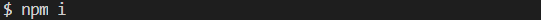

Do NPM i express & press enter

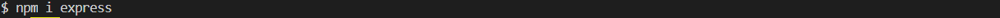

Do NPM i imethod-override & press enter

Do NPM i mysql & press enter

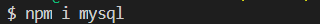

Do NPM i express-handlebars & press enter

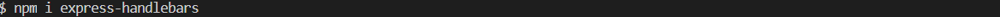

Write node server.js & press enter 

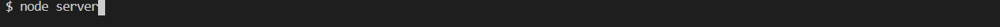

Write [http://localhost:8080/](<http://localhost:8080/>) and press enter

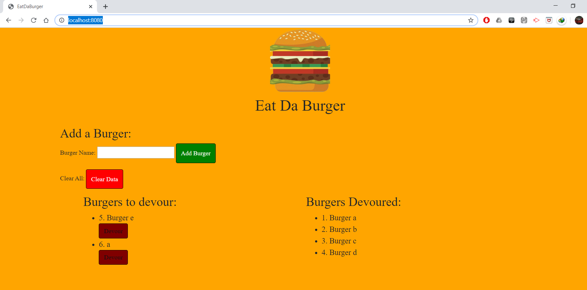

Write Burger name & press Add Burger

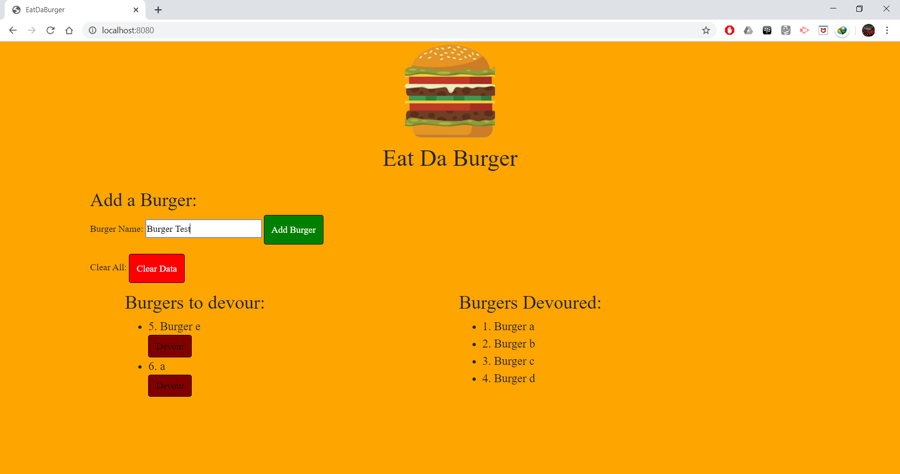

Burger Added

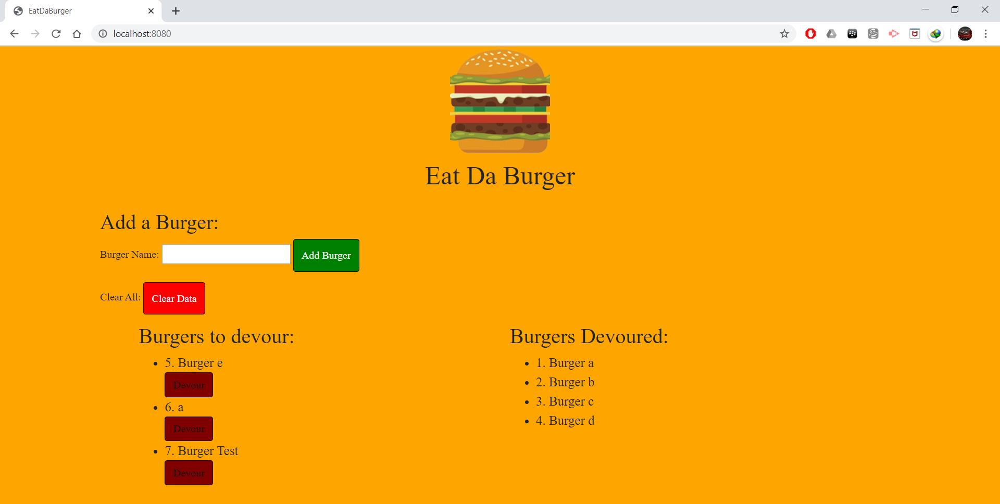

Press Devour to eat

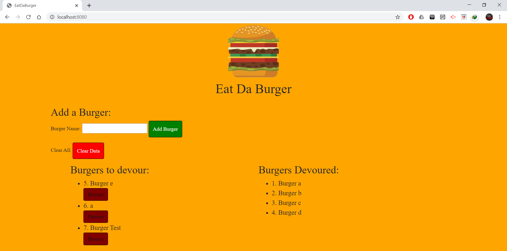

Devoured

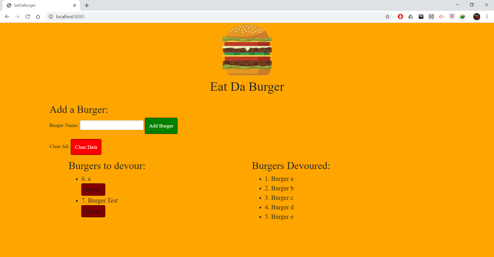

To Clear Data press Clear Data button

Data Cleared

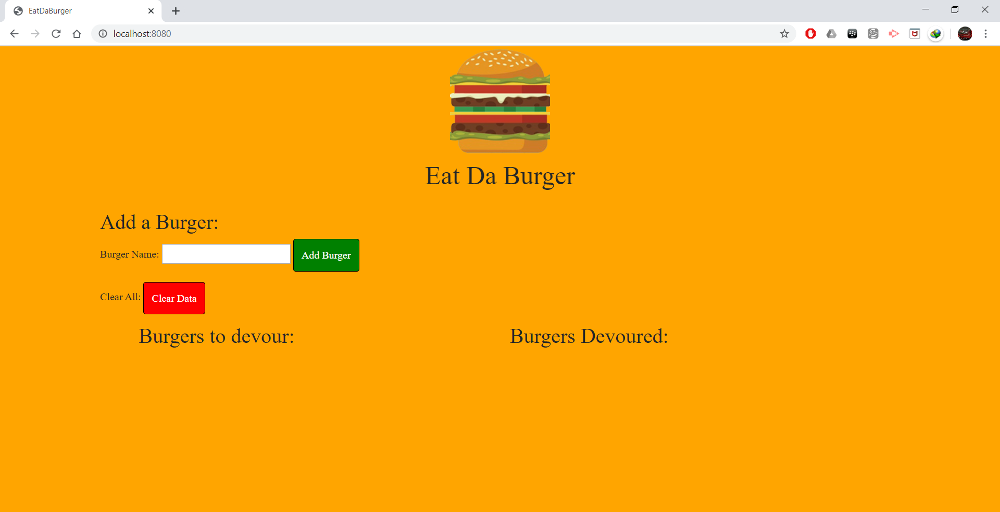

